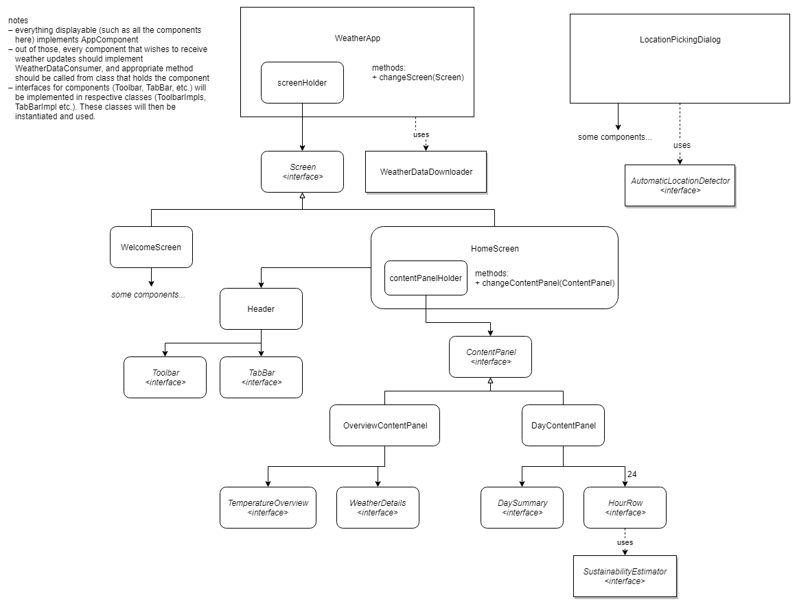

# Weather App

## Running the app

There are multiple ways to run the app:

- Run `weatherapp.jar`
  
  Required libraries are bundled in the JAR file. 

- Run `./gradlew run` in the terminal
  
  This will download necessary libraries, build the project and run it.

To run tests, run `./gradlew test` and find reports in `/build/reports/tests/test`

To build the JAR file bundled with all dependencies on your own, run `./gradlew fullJar`, the output is in `/build/libs`

## Requirements

_Java version 9 or higher is required._

_Internet connection is required for building and running the app._

## Tools & libraries

### Gradle

We used the **Gradle** build tool to build the project, manage dependencies, build-related tasks and project configuration.

### Development tools

- IntelliJ IDEA for software development

- Adobe Color CC for choosing color palette

### Libraries

The following libraries are used (listed as dependencies in the `build.gradle` file)

- [JUnit 4](https://junit.org/junit4/) (for unit tests)
- [Google Gson](https://github.com/google/gson) (parsing JSON from API calls)
- [Hamcrest](http://hamcrest.org/) (matchers for JUnit)

### Graphics

Icons made by <a href="https://www.flaticon.com/authors/pixel-buddha" title="Pixel Buddha">Pixel Buddha</a> from <a href="https://www.flaticon.com/" title="Flaticon">www.flaticon.com</a> are licensed by <a href="http://creativecommons.org/licenses/by/3.0/" title="Creative Commons BY 3.0" target="_blank">CC 3.0 BY</a>
 

Icons made by <a href="http://www.freepik.com" title="Freepik">Freepik</a> from <a href="https://www.flaticon.com/" title="Flaticon">www.flaticon.com</a> are licensed by <a href="http://creativecommons.org/licenses/by/3.0/" title="Creative Commons BY 3.0" target="_blank">CC 3.0 BY</a>

## UI Hierarchy

